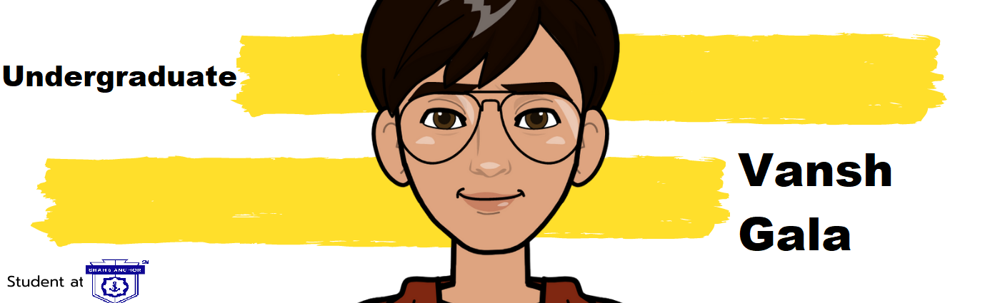

<h2>Hey! 👋</h2>

 

I'm Vansh Gala! 
- <i>Currently:</i> Computer Engineering Student at Shah & Anchor Kutchhi Engineering College . 

<h2>💻 Internships</h2>

- <i>Completed :</i> Intern at AS-44 . Skills : Web Development , PHP ,Mysql , Ajax , Javascript

<h2>💻 I'm Currently working on</h2>

- Ethical Hacking
- Software Engineering

<!-- __Check out my GitHub repository:__

  

    
    
  

<h2>👀 Stats</h2> -->

  

  <b><em>GitHub Stats:</em></b>  
       
  

<h2> About Vansh⚡:</h2>

I'm a UnderGraduate Student living in Mumbai. Outside Tech, I love to read, enjoy music and explore nature outdoors. If you are around Mumbai, drop an email and let's catch-up over Coffee!
 

- Write to me: [vanshjagani2002@gmail.com](mailto:vanshjagani2002@gmail.com)

<h2>📫 How to reach me:</h2>

 
